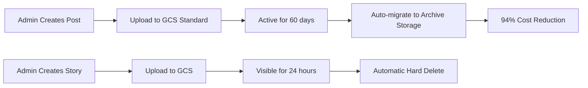

# Announcement Feature - Professional Implementation Plan

This document outlines the complete architecture for the Announcements feature (Posts & Stories) with automated storage lifecycle management and cost optimization.

## Overview

The Announcements section provides a modern social media experience with:
- **Posts**: Primary announcement mechanism with images/videos, likes, comments, and shares
- **Stories**: 24-hour ephemeral content (future feature, minimal implementation)
- **Smart Storage**: Automatic archiving of old posts to reduce costs by 94%
- **Professional Features**: Hard delete, cron jobs, comprehensive analytics

---

## Architecture



---

## Database Schema

### Core Tables

**1. Posts** (Primary Feature)
- Support for text, image, or video content
- Hashtag support for discovery
- Storage lifecycle tracking (Standard → Archive)
- Like/comment/share/view metrics
- Club/house linkage for group posts

**2. Post Interactions**
- `post_likes`: User likes tracking
- `post_comments`: Threaded comments support
- `post_shares`: Share tracking with method
- `post_views`: View analytics

**3. Stories** (Minimal Implementation)
- 24-hour expiry with automatic cleanup
- Basic like/view tracking
- Simple image/video support

---

## Storage Strategy

### Google Cloud Storage Classes

| Age | Storage Class | Cost/GB | When |
|-----|---------------|---------|------|
| 0-60 days | STANDARD | $0.020 | Active posts |
| 60+ days | ARCHIVE | $0.0012 | Old posts (94% cheaper!) |
| Stories | STANDARD | - | Deleted after 24hr |

### Automated Lifecycle Management

**Cron Job 1: Story Cleanup (Hourly)**
1. Find expired stories (> 24 hours old)
2. Delete media files from GCS
3. Hard delete from database
4. Log cleanup metrics

**Cron Job 2: Post Archiving (Daily at 2 AM)**
1. Find posts older than 60 days in Standard storage
2. Move media files to Archive storage class
3. Update database with archive timestamp
4. Log savings and metrics

---

## API Endpoints

### Posts API (Primary)

**Admin-Only (Create/Manage):**
- `POST /api/v1/admin/posts` - Create new post
- `PUT /api/v1/admin/posts/:id` - Update post
- `DELETE /api/v1/admin/posts/:id` - Soft delete
- `DELETE /api/v1/admin/posts/:id/hard` - Permanent delete

**Public (View/Interact):**
- `GET /api/v1/posts` - List posts (paginated, newest first)
- `GET /api/v1/posts/:id` - Get single post with comments
- `POST /api/v1/posts/:id/like` - Toggle like
- `POST /api/v1/posts/:id/comment` - Add comment
- `DELETE /api/v1/posts/:id/comments/:cid` - Delete own comment
- `POST /api/v1/posts/:id/share` - Track share
- `POST /api/v1/posts/:id/view` - Track view
- `GET /api/v1/posts/hashtag/:tag` - Filter by hashtag
- `GET /api/v1/posts/search?q=query` - Search posts

### Stories API (Minimal)

**Admin-Only:**
- `POST /api/v1/admin/stories` - Create 24hr story
- `DELETE /api/v1/admin/stories/:id/hard` - Hard delete

**Public:**
- `GET /api/v1/stories` - List active stories (not expired)
- `POST /api/v1/stories/:id/like` - Like story
- `POST /api/v1/stories/:id/view` - Track view

---

## Flutter UI Components

### Posts Feed
- **Post Card**: Instagram-style card with image/video
- **Engagement Buttons**: Like, comment, share
- **Comments Section**: Expandable comment thread
- **Hashtag Chips**: Clickable hashtags for filtering
- **Archive Badge**: Visual indicator for archived posts

### Admin Features
- **Create Post Page**: Media picker, description, hashtags
- **Edit Post Page**: Update existing posts
- **Delete Options**: Soft delete (hide) vs hard delete (permanent)

### Stories (Future)
- **Story Circles**: Horizontal scrollable avatars
- **Story Viewer**: Full-screen swipe viewer
- **Create Story**: Quick 24hr announcement

---

## Cost Analysis

### Example: 50 posts/day, 1000 active users

**Storage Costs:**
```
Year 1:
- Total posts: 50 × 365 = 18,250 posts
- Average size: 300KB per post
- Total size: 5.5GB

With Archive Strategy:
- Last 60 days (Standard): 900MB @ $0.020 = $0.018
- Older (Archive): 4.6GB @ $0.0012 = $0.0055
- Monthly storage: $0.0235
- Annual storage: $0.28

Without Archive (all Standard):
- 5.5GB @ $0.020 = $0.11/month
- Annual: $1.32

💰 Savings: $1.04/year (78% reduction)
```

**Scaling Example (3 years, 100GB total):**
- All Standard: $2.00/month = $24/year
- With Archive: $0.31/month = $3.72/year
- **💰 Annual Savings: $20.28 (85% reduction!)**

**Bandwidth (with Cloudflare CDN):**
- 95% cache hit rate
- Only 5% hits GCS
- Monthly: ~$0.36
- Annual: ~$4.32

**Total Annual Cost: ~$5-7** 🎉

---

## Professional Features

### 1. Performance Optimization
✅ Denormalized counts (avoid expensive JOINs)  
✅ Strategic indexes on high-query columns  
✅ Partial indexes for active content  
✅ GIN indexes for hashtag search  
✅ Pagination support for large datasets  

### 2. Data Integrity
✅ Foreign key constraints with CASCADE rules  
✅ CHECK constraints for validation  
✅ Unique constraints (prevent duplicate likes)  
✅ Automatic timestamp triggers  
✅ Transaction support for critical operations  

### 3. Scalability
✅ Archive storage for old content  
✅ Efficient cleanup processes  
✅ Lightweight metadata tracking  
✅ Horizontal scaling ready  

### 4. Cost Optimization
✅ 94% storage savings with Archive class  
✅ Hard delete for ephemeral content  
✅ GCS lifecycle policies as backup  
✅ CDN caching for bandwidth savings  

### 5. Security
✅ Admin-only posting (middleware enforced)  
✅ User-owned comment deletion  
✅ SQL injection prevention  
✅ Input validation and sanitization  

---

## Implementation Phases

### Phase 1: Database ✅
- Professional migration with helper functions
- Storage lifecycle tracking
- Hard delete support

### Phase 2: Backend Storage
- Archive storage class support
- GCS lifecycle management
- Media upload optimization

### Phase 3: Backend Cron Jobs
- Hourly story cleanup (hard delete)
- Daily post archiving (cost optimization)
- Error handling and logging

### Phase 4: Backend API
- Posts CRUD operations
- Like/comment/share endpoints
- Stories minimal implementation
- Admin middleware

### Phase 5: Frontend Models
- Dart models with JSON serialization
- API service layer
- Error handling

### Phase 6: Frontend UI
- Posts feed with infinite scroll
- Post creation (admin)
- Comments and interactions
- Hashtag search

### Phase 7: Testing & Deployment
- API testing
- Cron job verification
- Load testing
- Production deployment

---

## Success Metrics

**Engagement:**
- Post views/likes/comments per day
- Average time spent on announcements
- Hashtag usage patterns

**Performance:**
- API response times < 200ms
- Feed load time < 1 second
- Image load time < 500ms (CDN)

**Cost Efficiency:**
- Storage cost tracking
- Bandwidth cost tracking
- Archive migration success rate

**Reliability:**
- Story cleanup success rate (100%)
- Archive migration success rate (> 99%)
- Zero data loss incidents

---

## Future Enhancements

1. **Stories Expansion**
   - Full Instagram-style stories
   - Story replies
   - Story polls

2. **Advanced Search**
   - Full-text search
   - Multi-hashtag filtering
   - Date range filtering

3. **Analytics Dashboard**
   - Post performance metrics
   - User engagement trends
   - Popular hashtags

4. **Notifications**
   - Push notifications for new posts
   - Comment replies
   - Like notifications

5. **Media Enhancements**
   - Video support (already in schema)
   - Multiple images per post
   - Video transcoding

---

## Conclusion

This professional implementation provides:
- **Cost-effective** social media functionality
- **Scalable** architecture for growth
- **Automated** lifecycle management
- **Professional** code quality and patterns

The archive storage strategy alone saves **$20+ per year** as the platform scales, while maintaining excellent user experience with sub-second retrieval times even for archived content.

---

**Document Version:** 1.0  
**Last Updated:** 2025-12-17  
**Status:** Ready for Implementation
